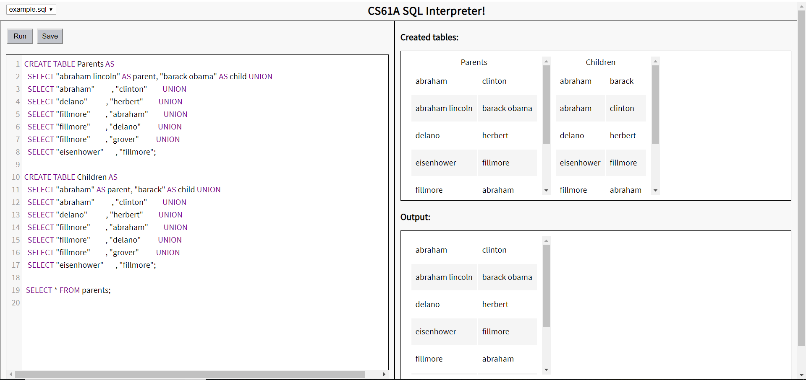

### SQL Editor for CS61A

This is a simple SQL Editor that allows you to edit and run SQL code from a file, as well as view the created tables. 



## Setup
Open the command line at the root directory and run:
<br>
```$ pip install -r requirements.txt```

After all the requirements have been downloaded, run:
<br>
```flask run```

This will start the editor on your local server. Copy and load the IP address specified in the command line (usually http://127.0.0.1:5000/) in a new browser window. 
